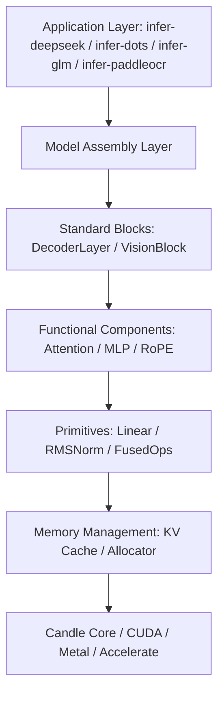

# deepseek-ocr 重构总计划（Detailed Plan）

> 目标：在不牺牲门禁严格一致性的前提下，系统性重构配置、缓存、算子与组装层，减少复制粘贴、提升可维护性，并持续优化推理性能与内存占用。

---

## 0. 项目级约束（必须遵守）

### 0.1 质量门槛

- 必须通过：
  - `cargo check --workspace --all-targets`
  - `cargo clippy --workspace --all-targets -- -D warnings`
- 不允许使用 attribute 隐藏问题（例如 `#[allow(clippy::...)]`）。
- 测试代码必须放在各 crate 的 `tests/` 目录中；业务 `src/**/*.rs` 不放 `#[cfg(test)] mod tests`。

### 0.2 门禁（以 benchsuite 为准）

- **快速迭代门禁（failfast + 单个代表性长 case）**

```bash
python -m benchsuite.cli matrix-gate \
  --run <run_id_iter> \
  --include-models <model> \
  --include-devices cpu \
  --include-precision f32 \
  --include-runtime-features accelerate \
  --cases <representative_case> \
  --max-new-tokens 8192 \
  --failfast
```

- **最终收尾门禁（failfast + 全量）**

```bash
python -m benchsuite.cli matrix-gate \
  --run <run_id_final> \
  --include-models <models...> \
  --include-devices cpu \
  --include-precision f32 \
  --include-runtime-features accelerate \
  --max-new-tokens 8192 \
  --failfast
```

- 产物必须可追溯：
  - `baselines/benchsuite/runs/<run_id>/matrix/summary.json`
  - `baselines/benchsuite/runs/<run_id>/matrix/report.txt`

---

## 1. 总体架构目标（High-Level Architecture）



核心原则：

1. **Canonical Runtime Config**（解析层与运行时配置分离）；
2. **共享行为上收**到 `core`，减少 infer-* 复制；
3. **性能优化不破坏一致性门禁**；
4. **每阶段都有可验证 DoD**。

---

## 2. 进度看板（Progress Tracking）

- [x] Phase 0：门禁流程与质量标准固化
- [x] Phase 1：基础类型与统一配置（已完成）
- [ ] Phase 2：内存管理与 KV Cache 优化
- [ ] Phase 3：算子抽象与融合
- [ ] Phase 4：组件组装与统一推理

---

## 3. Phase 1：基础类型与统一配置（Foundation & Configuration）

### 3.1 阶段目标

1. 引入统一 Runtime Config（`core`）作为推理链路的规范输入；
2. 将各模型 JSON/DTO 的默认值、兼容、补齐逻辑上收到转换层（`TryFrom`）；
3. 先迁移一条主链路（优先 `infer-deepseek`），再逐步推广到其他 crate。

### 3.2 示例代码（Rust Best Practice）

```rust
// crates/core/src/config.rs
#[derive(Debug, Clone)]
pub struct OcrModelConfig {
    pub hidden_size: usize,
    pub intermediate_size: usize,
    pub num_hidden_layers: usize,
    pub num_attention_heads: usize,
    pub num_kv_heads: usize,
    pub head_dim: usize,
    pub kv_head_dim: usize,
    pub v_head_dim: usize,
    pub vocab_size: usize,
    pub max_position_embeddings: usize,
    pub rms_norm_eps: f64,
    pub rope: RopeConfig,
}

#[derive(Debug, Clone)]
pub enum RopeConfig {
    Standard { theta: f64, rotary_dim: usize },
    MultiModal { theta: f64, sections: Vec<usize> },
}

impl OcrModelConfig {
    pub fn validate(&self) -> anyhow::Result<()> {
        anyhow::ensure!(self.hidden_size % self.num_attention_heads == 0);
        anyhow::ensure!(self.num_attention_heads % self.num_kv_heads == 0);
        Ok(())
    }
}
```

```rust
// infer-* 配置层（DTO -> Runtime）
impl TryFrom<RawDeepseekConfig> for DeepseekRuntimeConfig {
    type Error = anyhow::Error;

    fn try_from(raw: RawDeepseekConfig) -> Result<Self, Self::Error> {
        let num_kv_heads = raw.num_key_value_heads.unwrap_or(raw.num_attention_heads);
        let head_dim = raw.hidden_size / raw.num_attention_heads;
        let rope_dim = raw.qk_rope_head_dim.unwrap_or(head_dim);

        let base = OcrModelConfig {
            hidden_size: raw.hidden_size,
            intermediate_size: raw.intermediate_size,
            num_hidden_layers: raw.num_hidden_layers,
            num_attention_heads: raw.num_attention_heads,
            num_kv_heads,
            head_dim,
            kv_head_dim: raw.qk_nope_head_dim.unwrap_or(head_dim).max(1),
            v_head_dim: raw.v_head_dim.unwrap_or(head_dim).max(1),
            vocab_size: raw.vocab_size,
            max_position_embeddings: raw.max_position_embeddings,
            rms_norm_eps: raw.rms_norm_eps as f64,
            rope: RopeConfig::Standard {
                theta: raw.rope_theta as f64,
                rotary_dim: rope_dim.max(1),
            },
        };
        base.validate()?;
        Ok(Self { base, ..Default::default() })
    }
}
```

### 3.3 阶段任务清单（可打钩）

- [x] 在 `crates/core` 新增统一配置模块骨架（`config.rs`）
- [x] `infer-deepseek` 完成 DTO -> Runtime Config 转换实现
- [x] `infer-deepseek` 加载主链路改为使用 Runtime Config
- [x] 将热点 `unwrap_or` 默认逻辑从推理热路径上收至转换层
- [x] 新增转换测试到 `crates/infer-deepseek/tests/`

### 3.4 收尾标准（Definition of Done）

1. `infer-deepseek` 主推理链路以 Runtime Config 驱动；
2. Deepseek 关键默认值在转换层统一处理（如 `num_kv_heads` / `rope_dim` / `v_head_dim`）；
3. 转换测试通过；
4. 通过 `cargo check` + `clippy -D warnings`；
5. 通过至少一次 `matrix-gate --failfast` 单长 case（`accelerate + 8192`）。

---

## 4. Phase 2：内存管理与 KV Cache 优化（Memory & RSS）

### 4.1 阶段目标

1. 统一 KV Cache 抽象，支持分页化或静态策略；
2. decode 热路径避免不必要拼接与拷贝；
3. 重点压降 RSS/显存波动。

### 4.2 示例代码（方向）

```rust
pub trait KVCacheStorage {
    fn append(&mut self, layer_idx: usize, chunk: KvCacheChunk) -> anyhow::Result<()>;
    fn clear(&mut self);
    fn seq_len(&self) -> Option<usize>;
}

pub struct PagedKvCache {
    block_size: usize,
    // block_table + blocks ...
}
```

### 4.3 阶段任务清单

- [ ] 设计统一 `KVCacheStorage` 接口
- [ ] 深入替换仍存在 `key_view/value_view` 聚合路径的调用点
- [ ] 建立 RSS 对比基线（同 case / 同参数）
- [ ] 门禁验证性能与一致性

### 4.4 收尾标准（Definition of Done）

1. decode 热路径无多余聚合拷贝；
2. 代表性长序列 RSS 波动收敛；
3. 门禁严格一致（prompt/tokens/strict 都通过）。

---

## 5. Phase 3：算子抽象与融合（Primitives & Fusion）

### 5.1 阶段目标

1. 建立统一算子抽象（Linear/Norm/Activation）；
2. 为融合算子接入预留稳定接口；
3. 消除散落的重复 dtype/cast/shape 样板代码。

### 5.2 示例代码（方向）

```rust
pub trait Normalization {
    fn forward(&self, x: &Tensor) -> anyhow::Result<Tensor>;
}

pub enum DynLinear {
    Float(candle_nn::Linear),
    Quantized(candle_core::quantized::QMatMul),
}
```

### 5.3 阶段任务清单

- [ ] 统一 `DynLinear` 封装接入主链路
- [ ] RMSNorm/Rotary/SwiGLU 融合接口抽象
- [ ] 删除可归并的重复 cast/matmul 流程

### 5.4 收尾标准（Definition of Done）

1. 共享算子接口在至少两个 infer crate 复用；
2. 代码重复显著减少；
3. 编译、clippy、门禁全部通过。

---

## 6. Phase 4：组件组装与统一推理（Assembly）

### 6.1 阶段目标

1. 用组合式层级替换复制粘贴式 block 实现；
2. 新模型接入聚焦“配置转换 + 权重映射”，不重复写推理主干。

### 6.2 示例代码（方向）

```rust
pub struct DecoderLayer {
    attn: Box<dyn AttentionModule>,
    mlp: Box<dyn MlpModule>,
    norm1: Box<dyn Normalization>,
    norm2: Box<dyn Normalization>,
}
```

### 6.3 阶段任务清单

- [ ] 抽取共享 DecoderLayer 组装逻辑
- [ ] infer-* 对齐同一组装协议
- [ ] 新架构接入模板落地

### 6.4 收尾标准（Definition of Done）

1. 推理主干跨模型共享；
2. 新模型接入成本明显下降；
3. 全量门禁稳定通过。

---

## 7. 推进流程（每轮固定）

1. 明确本轮只改一个核心目标；
2. 小步提交（每步可编译、可回归）；
3. 每轮先 `check + clippy`，后跑 failfast 单 case；
4. 阶段收尾时跑 failfast 全量；
5. 写清 run id 与报告路径，确保可审计。

---

## 8. 当前迭代记录（实时更新）

- 当前阶段：**Phase 1**
- 当前状态：**已完成**
- 本轮目标：
  - [x] 恢复并细化 PLAN（详细版）
  - [x] 建立 `core` 统一配置模块初版
  - [x] 完成 deepseek DTO -> Runtime 迁移
  - [x] 完成阶段一迭代门禁（failfast 单 case）
- 下一里程碑：进入 Phase 2（KV Cache / RSS / decode 路径优化）。
