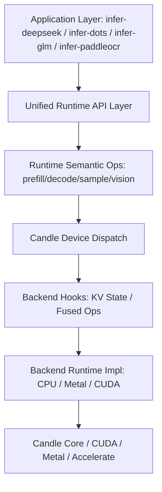

# deepseek-ocr 重构总计划（Detailed Plan）

> 目标：在不牺牲门禁严格一致性的前提下，系统性重构配置、缓存、算子与组装层，减少复制粘贴、提升可维护性，并持续优化推理性能与内存占用。

---

## 0. 项目级约束（必须遵守）

### 0.1 质量门槛

- 必须通过：
  - `cargo check --workspace --all-targets`
  - `cargo clippy --workspace --all-targets -- -D warnings`
- 不允许使用 attribute 隐藏问题（例如 `#[allow(clippy::...)]`）。
- 测试代码必须放在各 crate 的 `tests/` 目录中；业务 `src/**/*.rs` 不放 `#[cfg(test)] mod tests`。

### 0.2 门禁（以 benchsuite 为准）

- **快速迭代门禁（failfast + 单个代表性长 case）**

```bash
python -m benchsuite.cli matrix-gate \
  --run <run_id_iter> \
  --include-models <model> \
  --include-devices cpu \
  --include-precision f32 \
  --include-runtime-features accelerate \
  --cases <representative_case> \
  --max-new-tokens 8192 \
  --failfast
```

- **最终收尾门禁（failfast + 全量）**

```bash
python -m benchsuite.cli matrix-gate \
  --run <run_id_final> \
  --include-models <models...> \
  --include-devices cpu \
  --include-precision f32 \
  --include-runtime-features accelerate \
  --max-new-tokens 8192 \
  --failfast
```

- 产物必须可追溯：
  - `baselines/benchsuite/runs/<run_id>/matrix/summary.json`
  - `baselines/benchsuite/runs/<run_id>/matrix/report.txt`

---

## 1. 总体架构目标（High-Level Architecture）



核心原则：

1. **Canonical Runtime Config**（解析层与运行时配置分离）；
2. **共享行为上收**到 `core`，减少 infer-* 复制；
3. **性能优化不破坏一致性门禁**；
4. **统一 Runtime 语义接口 + 后端差异实现**（CPU/Metal/CUDA 各走最优路径）；
5. **性能改进必须量化**（`cargo bench` + benchsuite 双轨验证）；
6. **算子分发优先复用 `candle` 现有 `Device` 机制，不重复造调度轮子**；
7. **每阶段都有可验证 DoD**。

---

## 2. 进度看板（Progress Tracking）

- [x] Phase 0：门禁流程与质量标准固化
- [x] Phase 1：基础类型与统一配置（已完成）
- [ ] Phase 2：OCR Inference Engine 统一语义链路与后端状态管理
  - [ ] Stage 2A：契约冻结与类型落位
  - [ ] Stage 2B：Prompt 渲染语义统一
  - [ ] Stage 2C：图像预处理与 Prompt 注入统一
  - [ ] Stage 2D：Prefill/Decode 执行环统一
  - [ ] Stage 2E：CLI/Server 入口合流
  - [ ] Stage 2F：性能量化与门禁收尾
- [ ] Phase 3：算子抽象与融合
- [ ] Phase 4：组件组装与统一推理

---

## 3. Phase 1：基础类型与统一配置（Foundation & Configuration）

### 3.1 阶段目标

1. 引入统一 Runtime Config（`core`）作为推理链路的规范输入；
2. 将各模型 JSON/DTO 的默认值、兼容、补齐逻辑上收到转换层（`TryFrom`）；
3. 先迁移一条主链路（优先 `infer-deepseek`），再逐步推广到其他 crate。

### 3.2 示例代码（Rust Best Practice）

```rust
// crates/core/src/config.rs
#[derive(Debug, Clone)]
pub struct OcrModelConfig {
    pub hidden_size: usize,
    pub intermediate_size: usize,
    pub num_hidden_layers: usize,
    pub num_attention_heads: usize,
    pub num_kv_heads: usize,
    pub head_dim: usize,
    pub kv_head_dim: usize,
    pub v_head_dim: usize,
    pub vocab_size: usize,
    pub max_position_embeddings: usize,
    pub rms_norm_eps: f64,
    pub rope: RopeConfig,
}

#[derive(Debug, Clone)]
pub enum RopeConfig {
    Standard { theta: f64, rotary_dim: usize },
    MultiModal { theta: f64, sections: Vec<usize> },
}

impl OcrModelConfig {
    pub fn validate(&self) -> anyhow::Result<()> {
        anyhow::ensure!(self.hidden_size % self.num_attention_heads == 0);
        anyhow::ensure!(self.num_attention_heads % self.num_kv_heads == 0);
        Ok(())
    }
}
```

```rust
// infer-* 配置层（DTO -> Runtime）
impl TryFrom<RawDeepseekConfig> for DeepseekRuntimeConfig {
    type Error = anyhow::Error;

    fn try_from(raw: RawDeepseekConfig) -> Result<Self, Self::Error> {
        let num_kv_heads = raw.num_key_value_heads.unwrap_or(raw.num_attention_heads);
        let head_dim = raw.hidden_size / raw.num_attention_heads;
        let rope_dim = raw.qk_rope_head_dim.unwrap_or(head_dim);

        let base = OcrModelConfig {
            hidden_size: raw.hidden_size,
            intermediate_size: raw.intermediate_size,
            num_hidden_layers: raw.num_hidden_layers,
            num_attention_heads: raw.num_attention_heads,
            num_kv_heads,
            head_dim,
            kv_head_dim: raw.qk_nope_head_dim.unwrap_or(head_dim).max(1),
            v_head_dim: raw.v_head_dim.unwrap_or(head_dim).max(1),
            vocab_size: raw.vocab_size,
            max_position_embeddings: raw.max_position_embeddings,
            rms_norm_eps: raw.rms_norm_eps as f64,
            rope: RopeConfig::Standard {
                theta: raw.rope_theta as f64,
                rotary_dim: rope_dim.max(1),
            },
        };
        base.validate()?;
        Ok(Self { base, ..Default::default() })
    }
}
```

### 3.3 阶段任务清单（可打钩）

- [x] 在 `crates/core` 新增统一配置模块骨架（`config.rs`）
- [x] `infer-deepseek` 完成 DTO -> Runtime Config 转换实现
- [x] `infer-deepseek` 加载主链路改为使用 Runtime Config
- [x] 将热点 `unwrap_or` 默认逻辑从推理热路径上收至转换层
- [x] 新增转换测试到 `crates/infer-deepseek/tests/`

### 3.4 收尾标准（Definition of Done）

1. `infer-deepseek` 主推理链路以 Runtime Config 驱动；
2. Deepseek 关键默认值在转换层统一处理（如 `num_kv_heads` / `rope_dim` / `v_head_dim`）；
3. 转换测试通过；
4. 通过 `cargo check` + `clippy -D warnings`；
5. 通过至少一次 `matrix-gate --failfast` 单长 case（`accelerate + 8192`）。

---

## 4. Phase 2：OCR Inference Engine 统一语义链路与后端状态管理（OIE Runtime）

### 4.1 阶段目标

1. 建立统一 `OCR Inference Engine` 语义入口，覆盖完整链路：配置解析 → 预处理 → prompt rendering → prompt injection → prefill/decode → 采样 → 后处理；
2. 统一高层 API，同时允许模型差异通过 `ModelSemantics` 实现，不再在各 crate 复制整条流程；
3. 统一 `RuntimeState`（KV/rope/workspace/request-scope lifecycle），并由 guard 保障请求级清理；
4. 设备差异与优化全部下沉到 backend runtime/hook 层，默认算子优先复用 `candle` `Device` 自动分发；
5. 将 CLI/Server 的推理路径统一到同一 engine API，避免入口层行为分叉；
6. 建立可预测、可对比、可回归的性能评测标准（`cargo bench` + benchsuite）。

### 4.2 分阶段推进（拆分执行）

#### Stage 2A：契约冻结与类型落位（Contract Freeze）

- 目标：先冻结统一接口，不急于迁移全部实现，避免边改边漂移。
- 交付：
  - `OcrInferenceEngine` / `OcrInferenceRequest` / `OcrInferenceResult`
  - `ModelSemantics` / `RuntimeState` / `RuntimeBackend` / `BackendCaps`
  - `PromptScopeGuard`（请求级状态清理）
- DoD：
  - `core` 接口可编译通过；
  - 旧路径仍可运行，不破坏现有行为；
  - `check + clippy -D warnings` 通过。

#### Stage 2B：Prompt 渲染语义统一（Rendering Semantics）

- 目标：统一“文本模板 + 消息拼接 + `<image>` 校验 + 错误语义”。
- 交付：
  - `render_prompt` 升级为语义接口（支持 CLI/Server 共用）；
  - `ModelSemantics::render_prompt` 实现（DeepSeek/GLM/Paddle/Dots 各自差异）；
  - 统一错误类型（槽位不匹配、模板非法、输入为空）。
- DoD：
  - CLI/Server 不再各写一套 prompt 组装；
  - prompt 行为有真实 fixture 测试覆盖；
  - 门禁 strict 不受影响。

#### Stage 2C：图像预处理与 Prompt 注入统一（Preprocess + Injection）

- 目标：统一图像预处理输出与文本/图像注入流程。
- 交付：
  - `ModelSemantics::preprocess_images`
  - `ModelSemantics::prepare_inputs`
  - 统一输入容器（token ids、mask、position ids、image embeds）
- DoD：
  - 各模型 `build_prompt_*` 的共享流程上收；
  - 模型仅保留必要差异（token 规则/position 规则）；
  - 编译与 clippy 全绿。

#### Stage 2D：Prefill/Decode 执行环统一（Runtime Loop）

- 目标：统一 prefill/decode 主循环，模型不再重复写生成流程。
- 交付：
  - `OcrInferenceEngine::generate` 主流程落地；
  - 统一采样、stream callback、EOS 处理、postprocess；
  - `RuntimeState` 全量接管 cache/rope/workspace。
- DoD：
  - 至少 1 条主模型链路完整迁移；
  - 无跨请求状态泄漏；
  - failfast 单 case 通过。

#### Stage 2E：CLI/Server 入口合流（Entry Convergence）

- 目标：统一调用路径，避免入口层逻辑分叉。
- 交付：
  - CLI 通过 `OcrInferenceEngine` 调用；
  - Server 通过 `OcrInferenceEngine` 调用；
  - 统一日志、错误映射、统计输出。
- DoD：
  - CLI/Server 不再维护独立推理主干；
  - 兼容现有请求参数与输出格式；
  - 回归测试通过。

#### Stage 2F：性能量化与门禁收尾（Perf + Gate）

- 目标：在统一架构下确认性能与一致性不回退。
- 交付：
  - `cargo bench` 分层结果（L1/L2）；
  - benchsuite failfast 单代表 + 最终全量收尾报告；
  - 性能回归阈值评估结论。
- DoD：
  - 吞吐/延迟/RSS 达标；
  - strict/prompt/tokens 全绿；
  - 产物路径可追溯。

### 4.3 核心接口草案（方向）

```rust
pub struct OcrInferenceEngine {
    pub config: Arc<AppResolvedConfig>,
    pub semantics: Box<dyn ModelSemantics>,
    pub runtime: RuntimeEngine,
}

pub struct OcrInferenceRequest<'a> {
    pub messages: &'a [ApiMessage],
    pub images: &'a [DynamicImage],
    pub decode: DecodeParameters,
    pub vision: VisionSettings,
}

pub struct OcrInferenceResult {
    pub text: String,
    pub prompt_tokens: usize,
    pub response_tokens: usize,
    pub generated_tokens: Vec<i64>,
}

pub trait ModelSemantics: Send + Sync {
    fn kind(&self) -> ModelKind;

    fn render_prompt(&self, req: &InferenceRequest<'_>) -> anyhow::Result<RenderedPrompt>;

    fn preprocess_images(
        &self,
        req: &InferenceRequest<'_>,
    ) -> anyhow::Result<ModelImageInputs>;

    fn prepare_inputs(
        &self,
        rendered: &RenderedPrompt,
        images: &ModelImageInputs,
        state: &mut RuntimeState,
    ) -> anyhow::Result<PreparedInputs>;

    fn postprocess_text(&self, decoded: &str) -> String;
}

pub struct RuntimeState {
    pub kv: KvStateBackend,
    pub rope: RopeState,
    pub workspace: WorkspaceArena,
    pub seq_len: usize,
}

impl OcrInferenceEngine {
    pub fn generate(
        &mut self,
        req: &OcrInferenceRequest<'_>,
        state: &mut RuntimeState,
    ) -> anyhow::Result<OcrInferenceResult> {
        // 统一流程：
        // 1) 渲染 prompt
        // 2) 图像预处理
        // 3) prompt/image 注入并准备输入
        // 4) runtime prefill + decode + sample
        // 5) 文本后处理
        todo!()
    }
}

pub struct BackendCaps {
    pub paged_kv: bool,
    pub fused_attention: bool,
    pub fused_mlp: bool,
    pub prefers_static_workspace: bool,
}
```

### 4.4 阶段任务清单（可执行）

- [ ] Stage 2A：在 `crates/core` 固化 `OcrInferenceEngine/OcrInferenceRequest/OcrInferenceResult/ModelSemantics` 契约
- [ ] 固化统一配置解析入口，明确优先级：CLI Args 覆盖 Config File 覆盖内置默认
- [ ] Stage 2B：统一 prompt rendering 语义接口（模板渲染、占位符校验、错误语义）
- [ ] Stage 2C：统一 prompt injection 语义接口（文本 token + 图像 token/embedding 注入）
- [ ] 将 `KV cache + rope + workspace` 收口到 `RuntimeState`（禁止散落管理）
- [ ] Stage 2D：先落地基线 Runtime 实现（默认算子全部走 `candle` `Device` 自动分发）
- [ ] 接入 Metal/CUDA 专项 hook（KV/融合），不复制 `candle` 算子分发逻辑
- [ ] Stage 2E：迁移 CLI/Server 到统一 `OcrInferenceEngine::generate`，移除入口层重复流程
- [ ] Stage 2E：迁移各模型 `build_prompt_* / prepare_*` 到 `ModelSemantics` 实现并删除重复逻辑
- [ ] 审计并移除重复“手写后端调度器”代码路径（与 candle 重复者）
- [ ] Stage 2F：完成性能评测对比与最终门禁收尾

### 4.5 性能评测标准（统一）

#### 4.4.1 分层评测

- `L1 微基准（cargo bench）`：
  - `config_resolve`
  - `prompt_render`
  - `prompt_injection`
  - `backend_prefill_step`
  - `backend_decode_step`
  - `runtime_state_update`（含 cache append/read）
- `L2 端到端基准（cargo bench + 真实配置）`：
  - `TTFT`
  - `prefill tokens/s`
  - `decode tokens/s`
  - `P50/P95 latency`
  - `peak RSS`
- `L3 一致性门禁（benchsuite）`：
  - `strict/prompt/tokens` 必须全部通过

#### 4.4.2 场景与对比规范

- 同一比较必须固定：模型、case、dtype、feature、seed、线程数、`max_new_tokens`。
- 快速迭代固定使用：`accelerate + 8192 + failfast + 单代表长 case`。
- 阶段收尾固定使用：`accelerate + 8192 + failfast + 全量目标模型`。
- 每次评测都输出并归档 JSON 结果，确保可追溯和可视化。

#### 4.4.3 回归阈值（初版）

- 一致性阈值：`strict/prompt/tokens` 任一失败即阻断。
- 吞吐阈值：`decode tokens/s` 回退不得超过 `2%`。
- 延迟阈值：`TTFT` 回退不得超过 `5%`。
- 内存阈值：`peak RSS` 增长不得超过 `3%`。

### 4.6 收尾标准（Definition of Done）

1. 配置解析、prompt 渲染/注入、prefill/decode 在同一 `OcrInferenceEngine` 语义链路执行；
2. CLI/Server 调用同一个 engine API，不再各自维护推理流程；
3. 模型差异仅通过 `ModelSemantics` 实现暴露，公共流程不再复制；
4. `RuntimeState` 统一管理 cache/rope/workspace，不再散落；
5. 算子后端分发主路径由 `candle` `Device` 承担，无重复调度框架；
6. backend 特化优化（含融合）仅存在于 hooks/runtime 实现层；
7. Stage 2A~2F 全部完成并有产物记录；
8. `cargo bench` 指标可重复、可对比，且达到回归阈值；
9. 门禁严格一致（prompt/tokens/strict 全通过）。

---

## 5. Phase 3：算子抽象与融合（Primitives & Fusion）

### 5.1 阶段目标

1. 建立统一算子抽象（Linear/Norm/Activation）；
2. 为融合算子接入预留稳定接口（按 backend 实现，不污染模型层）；
3. 消除散落的重复 dtype/cast/shape 样板代码。

### 5.2 示例代码（方向）

```rust
pub trait Normalization {
    fn forward(&self, x: &Tensor) -> anyhow::Result<Tensor>;
}

pub enum DynLinear {
    Float(candle_nn::Linear),
    Quantized(candle_core::quantized::QMatMul),
}
```

### 5.3 阶段任务清单

- [ ] 统一 `DynLinear` 封装接入主链路
- [ ] RMSNorm/Rotary/SwiGLU 融合接口抽象（CPU/Metal/CUDA 分治实现）
- [ ] 删除可归并的重复 cast/matmul 流程

### 5.4 收尾标准（Definition of Done）

1. 共享算子接口在至少两个 infer crate 复用；
2. 代码重复显著减少；
3. 编译、clippy、门禁全部通过。

---

## 6. Phase 4：组件组装与统一推理（Assembly）

### 6.1 阶段目标

1. 用组合式层级替换复制粘贴式 block 实现；
2. 新模型接入聚焦“配置转换 + 权重映射”，不重复写推理主干。

### 6.2 示例代码（方向）

```rust
pub struct DecoderLayer {
    attn: Box<dyn AttentionModule>,
    mlp: Box<dyn MlpModule>,
    norm1: Box<dyn Normalization>,
    norm2: Box<dyn Normalization>,
}
```

### 6.3 阶段任务清单

- [ ] 抽取共享 DecoderLayer 组装逻辑
- [ ] infer-* 对齐同一组装协议
- [ ] 新架构接入模板落地

### 6.4 收尾标准（Definition of Done）

1. 推理主干跨模型共享；
2. 新模型接入成本明显下降；
3. 全量门禁稳定通过。

---

## 7. 推进流程（每轮固定）

1. 明确本轮只改一个核心目标；
2. 小步提交（每步可编译、可回归）；
3. 每轮先 `cargo bench`（最小代表场景）确认方向，再做实现迭代；
4. 每轮先 `check + clippy`，后跑 failfast 单 case；
5. 阶段收尾时跑 failfast 全量（`accelerate + 8192`）；
6. 每轮写清 run id / benchmark 输出 / 报告路径，确保可审计。

---

## 8. 当前迭代记录（实时更新）

- 当前阶段：**Phase 2**
- 当前状态：**方案补充中（待按新接口落实现）**
- 本轮目标：
  - [x] 确认高层抽象应为统一 OCR Inference Engine 语义链路（而非仅 KV cache）
  - [x] 确认算子分发优先复用 candle Device 机制（避免重复造轮子）
  - [x] 确认性能评测采用 `cargo bench` 分层量化标准
  - [ ] Stage 2A：固化 `core` OcrInferenceEngine/ModelSemantics 契约并评审
  - [ ] 迁移一条真实模型链路（配置→prompt→decode）到统一 engine
- 下一里程碑：完成 Stage 2A/2B 并开始 Stage 2C 首条链路迁移。
